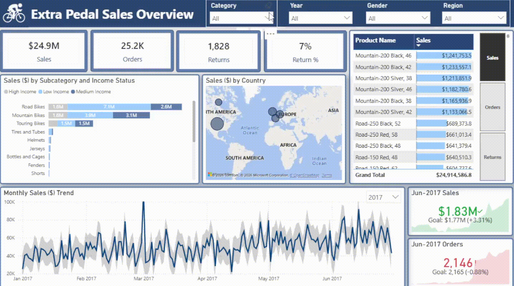
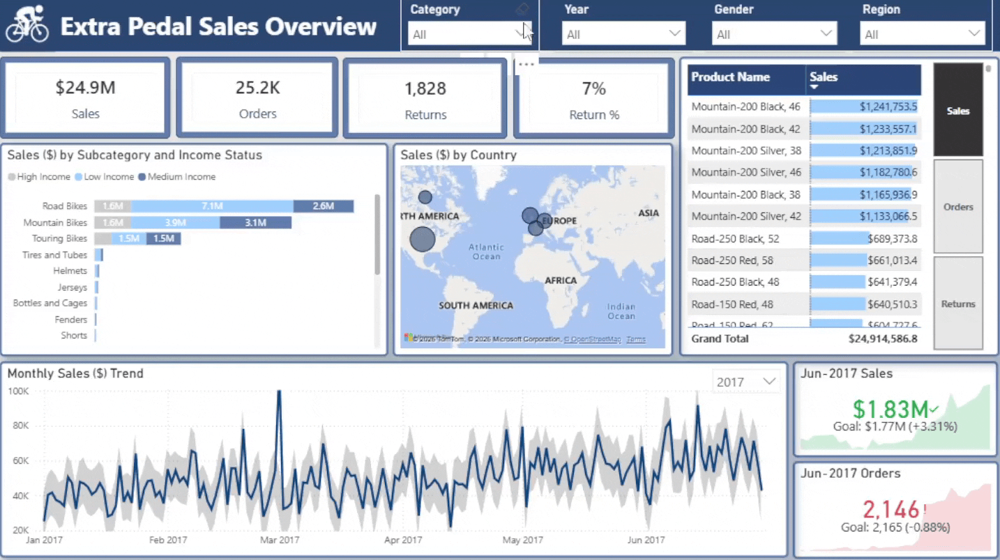
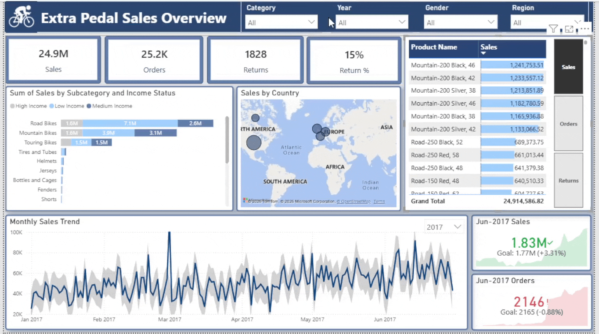

# Extra Pedal Sales Analysis

## Project Overview

This project focuses on building a professional sales analytics dashboard using Power BI. The workflow covers data preparation, transformation, modeling, visualization, and dashboard storytelling based on raw sales-related datasets.

## Source Files and Columns

The project uses the following raw files from the Data/Raw folder:

### 1. Sales 2015.csv
- Columns:
  - OrderDate
  - StockDate
  - OrderNumber
  - ProductKey
  - CustomerKey
  - TerritoryKey
  - OrderLineItem
  - OrderQuantity

### 2. Sales 2016.csv
- Columns:
  - OrderDate
  - StockDate
  - OrderNumber
  - ProductKey
  - CustomerKey
  - TerritoryKey
  - OrderLineItem
  - OrderQuantity

### 3. Sales 2017.csv
- Columns:
  - OrderDate
  - StockDate
  - OrderNumber
  - ProductKey
  - CustomerKey
  - TerritoryKey
  - OrderLineItem
  - OrderQuantity

### 4. Customers Table.csv
- Columns:
  - CustomerKey
  - Prefix
  - FirstName
  - LastName
  - BirthDate
  - MaritalStatus
  - Gender
  - EmailAddress
  - AnnualIncome
  - TotalChildren
  - EducationLevel
  - Occupation
  - HomeOwner

### 5. Products.csv
- Columns:
  - ProductKey
  - ProductSubcategoryKey
  - ProductSKU
  - ProductName
  - ModelName
  - ProductDescription
  - ProductColor
  - ProductSize
  - ProductStyle
  - ProductCost
  - ProductPrice

### 6. Product Categories.csv
- Columns:
  - ProductCategoryKey
  - CategoryName

### 7. Product Subcategories.csv
- Columns:
  - ProductSubcategoryKey
  - SubcategoryName
  - ProductCategoryKey

### 8. Territories.csv
- Columns:
  - SalesTerritoryKey
  - Region
  - Country
  - Continent

### 9. Returns.csv
- Columns:
  - ReturnDate
  - TerritoryKey
  - ProductKey
  - ReturnQuantity

### 10. Calendar.csv
- Columns:
  - Date

## Dashboard Demo

---

---

