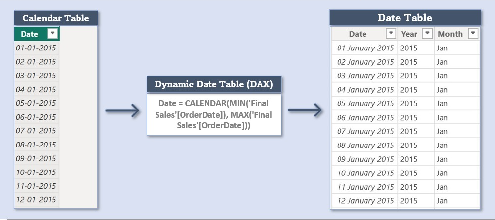
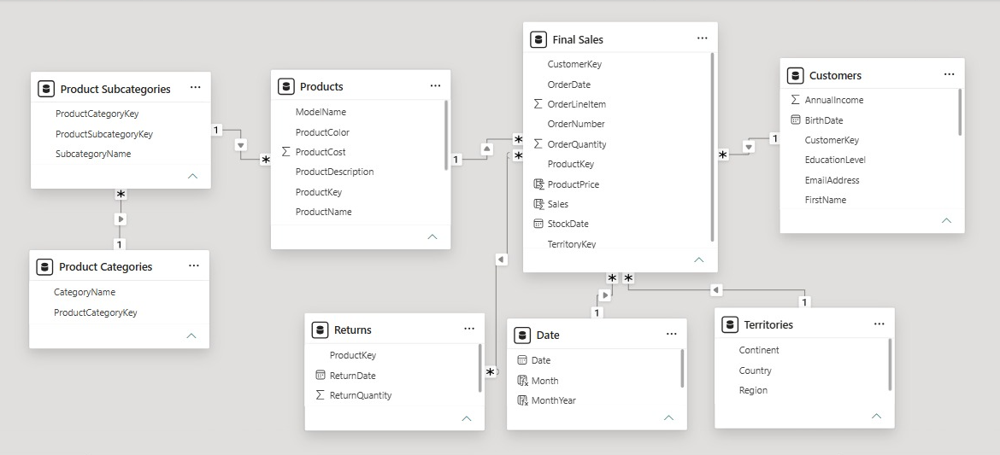
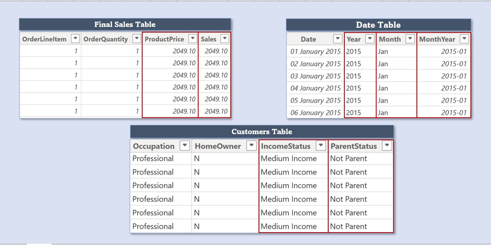
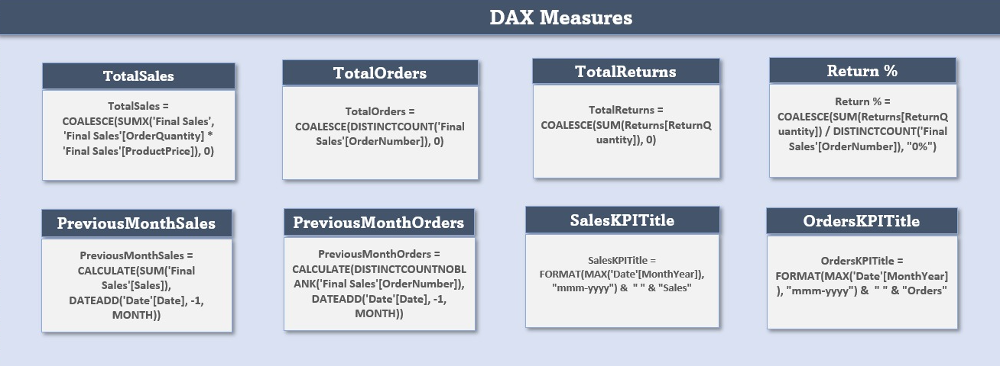
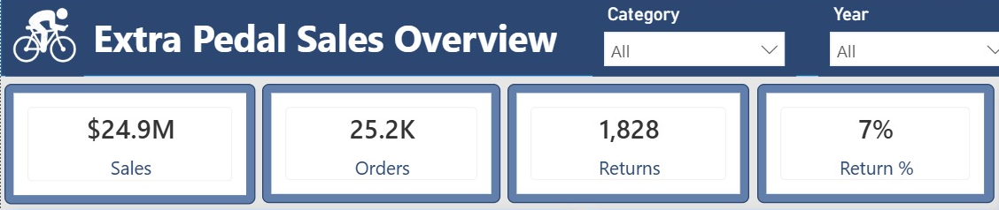
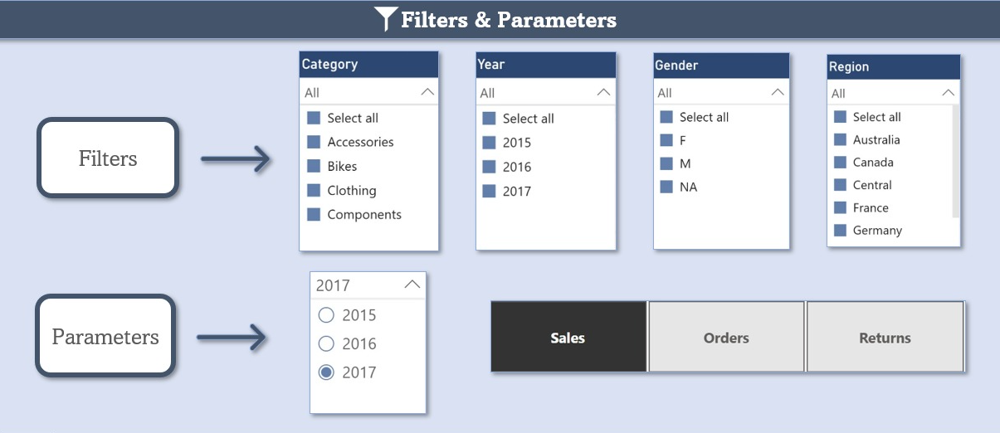
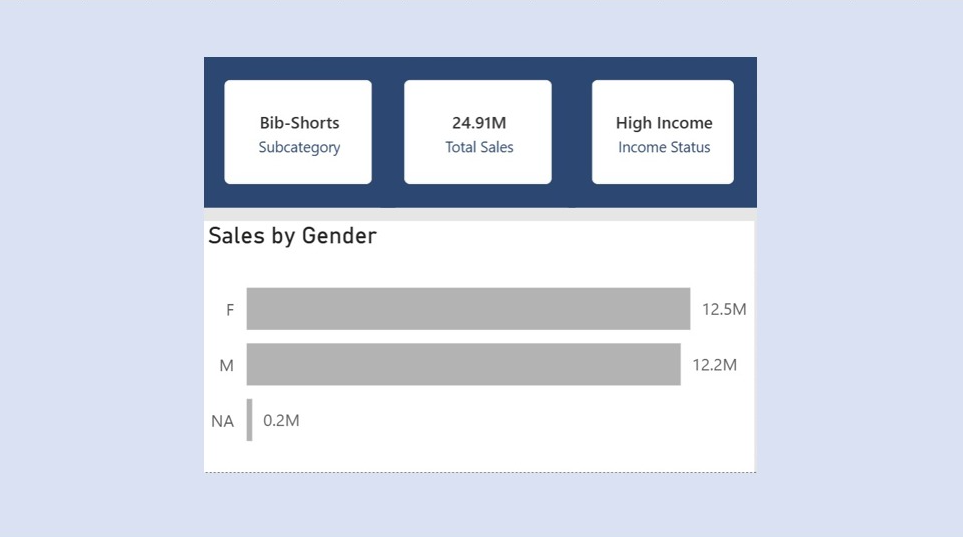
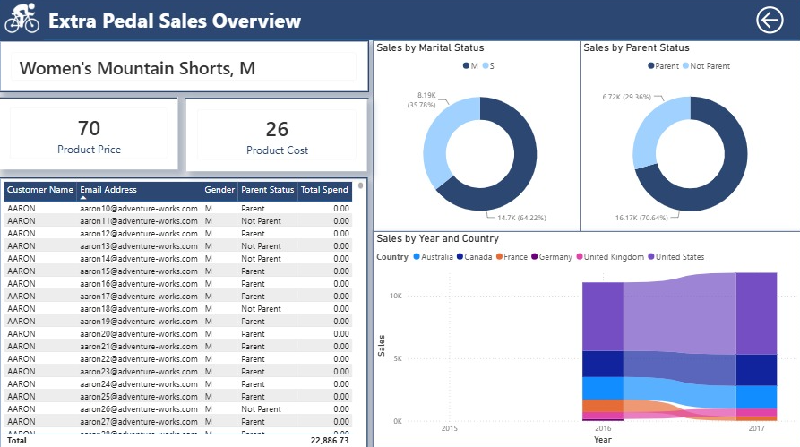
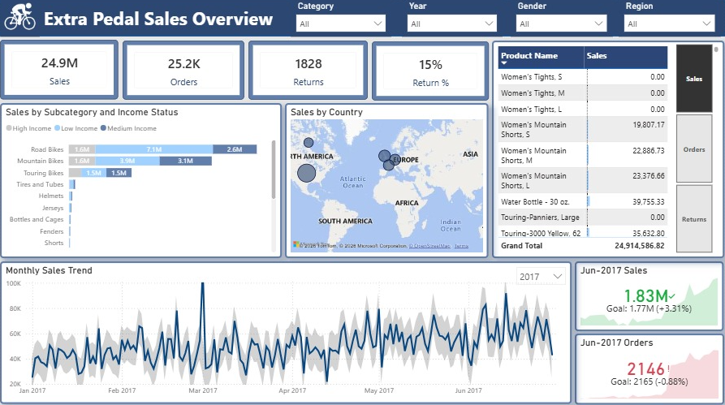

## 📊 Extra Pedal Sales Analysis 
  
## 🔹 Project Overview

This project is an interactive **Microsoft Power BI** dashboard built using the **Extra Pedal Sales** dataset.

The dashboard provides a comprehensive analysis of **sales performance** and the key factors influencing it, including **products, customers, regions, and returns**, through interactive visualizations and KPIs.

---

## 🔹 Business Problem

Raw sales data alone does not provide immediate business value unless it is cleaned, modeled, and visualized properly. This project addresses that gap by helping answer key questions such as:

- Which products are driving the highest sales?
- Which regions and territories are performing best?
- How do returns affect overall sales performance?
- Which product categories are contributing most to revenue?
- How can sales trends be interpreted across multiple years?

---

## 🔹 Tools & Technologies

- Microsoft Power BI
- Power Query
- DAX
- Data Modeling
- Data Cleaning and Transformation
- Dashboard Design

---

## 🔹 Dataset Overview

The project uses multiple raw CSV files stored in the data folder. The data covers sales transactions, customer information, product details, territories, product hierarchy, and return records

### Source Files Used

- Sales 2015.csv             
- Sales 2016.csv               
- Sales 2017.csv             
- Customers Table.csv        
- Products.csv               
- Product Categories.csv     
- Product Subcategories.csv  
- Territories.csv            
- Returns.csv                
- Calendar.csv


### Dataset Link :- https://github.com/Chauhanekta21/Extra_Pedal_Sales_Analysis/tree/main/Data/Raw


---

## 🔹 Analytics Workflow

```text
Raw Data
    ↓
Data Import
    ↓
Data Cleaning
    ↓
Data Transformation
    ↓
Data Modeling
    ↓
DAX Measures
    ↓
Charts & Visuals
    ↓
Interactive Dashboard
```

---

## 🔹 Data Preparation and ETL Process

### 1. Data Import
- Imported raw CSV files into Power BI from the data folder.
- Loaded sales data from multiple yearly files.
- Added supporting tables for products, customers, territories, calendar, and returns.

### 2. Data Cleaning
- Promoted the first row to column headers across all tables.
- Removed unnecessary rows from the raw datasets.
- Standardized date formats across transaction and return files.
- Checked and corrected data types for quantity, cost, and price-related fields.

### 3. Data Transformation
- Appended the yearly sales datasets (2015, 2016, and 2017) into a single **Final Sales** table.
- Organized product information into category and subcategory hierarchies.

### 4. Data Loading
- Loaded the transformed tables into the Power BI data model.
- Established relationships between fact and dimension tables to create a star schema.
- Validated the model before creating DAX measures and dashboard visualizations.

---

## 🔹 Date Table Creation

- Replaced the static **Calendar** table with a dynamic **Date** table created using DAX.
- Included key date fields: **Date**, **Month**, and **Year**.
- Marked it as the official **Date Table** and related it to the **Final Sales** table for time-based analysis.



---

## 🔹 Data Model

The project uses a relational data model where sales transactions are linked to product, customer, territory, and time-related data. This makes the dashboard more scalable and allows multiple perspectives of the same business dataset.



---

## 🔹 Calculated Columns

1.  Customers Table
  -   IncomeStatus: Used to classify customers into Low Income, Medium Income, and High Income for sales analysis by income group.
  -   ParentStatus: Used to identify whether a customer is a parent or not parent, mainly for the product details drill-through report.

2.  Date Table
  -   Month: Extracts the month from the date field for monthly trend analysis.
  -   Year: Extracts the year for year-wise comparison.
  -   MonthYear: Combines Month and Year into a single label, used as the trend axis for Sales KPI and Order KPI.

3.  Final Sales Table
  -   Product Price: Used as part of the sales calculation logic.
  -   Sales: Represents the final sales value used for KPI reporting and dashboard visuals.



---

## 🔹 Business Metrics and DAX Measures

-  TotalSales: Calculates overall sales value and is used in KPI cards and sales summary visuals.
-  TotalQuantity: Measures total units sold and helps show product demand.
-  TotalReturns: Tracks returned items and supports return analysis.
-  Return %: Shows the percentage of returns relative to total orders or sales.
-  TotalOrders: Counts total orders and is used in order-based KPI analysis.
-  PreviousMonthOrders: Compares current orders with the previous month.
-  PreviousMonthSales: Compares sales with the previous month for month-over-month analysis.
-  SalesKPITitle: Creates the title for the sales KPI visual.
-  OrdersKPITitle: Creates the title for the orders KPI visual.



---

🔹 KPI Summary

The dashboard includes key performance indicators that help track overall business health and sales performance.

-  Sales: Tracks total revenue generated.
-  Orders: Shows the total number of orders placed.
-  Returns: Displays the total quantity of returned items.
-  Return %: Helps understand the level of return quantity compared to the number of orders.



---

## 🔹 Filters and Parameters

The dashboard includes interactive controls to refine the analysis.

### Filters

- These filters apply to the KPIs and most visuals, except the Monthly Sales Trend chart.
  - Category
  - Year
  - Gender
  - Region

  - Note: The Gender filter affects all visuals and KPIs except the Returns and Returns % cards. This is because the Returns table does             not contain customer/gender information or a relationship that allows Gender to filter return data.

### Parameters
- Metrics Parameter: Switches between Sales, Orders, and Returns for the Product Table chart.
- Year Parameter: Switches between 2015, 2016, and 2017 for the Monthly Sales Trend chart.



---

## 🔹 Custom Tooltip
Added a custom tooltip to the **Sales by Subcategory and Income Status** chart, showing the **subcategory, total sales, income status KPIs, and sales by gender** for deeper context on hover.



---

## 🔹 Drillthrough Report

- Added a drillthrough page for **product-level analysis**.
- Displays **Product Name, Product Cost, and Product Price** as KPIs.
- Includes a **customer table** with Customer Name, Email, Gender, Parent Status, and Total Spend.
- Shows **Sales by Marital Status** and **Sales by Parent Status** using donut charts.
- Shows **Sales by Year and Country** using a ribbon chart.



---

## 🔹 Dashboard Preview
The final dashboard presents a clean and interactive view of KPIs, trend analysis, product performance, and regional insights in a single layout.



---

## 🔹 Dashboard Demo (GIF)
A short walkthrough of the dashboard is included below to demonstrate the visual interaction and KPI behavior.


---

## 🔷 Interactive Dashboard:

Download and explore the dashboard locally:
Dashboard Workbook: https://github.com/Chauhanekta21/Extra_Pedal_Sales_Analysis/blob/main/Dashboard/Extra_Pedal_Sales_Dashboard.pbix

---

## 🔹 Key Insights

- **Bikes** is the strongest-performing category and the primary driver of overall sales, while **Components** recorded zero sales despite having available products.
- **Top 5 sales regions** are **Australia, Southwest (US), Northwest (US), United Kingdom, and Germany**.
- **Sales increased across 2015–2017**, with 2017 showing a slight decline compared with the previous year due to the partial-year data.
- **June 2017 sales reached £1.83M**, exceeding the **£1.77M target by £60K (3.4%)**.
- **June 2017 orders reached 2,146**, falling just **19 orders (0.9%)** short of the **2,165 target**.
- **Female customers generated slightly higher sales (£12.5M)** than Male customers (£12.2M), despite Male customers placing more orders (12.6K vs 12.4K).
- Unexpectedly, lower-income customers emerge as major revenue contributors across multiple subcategories, outperforming higher-income segments in sales contribution
- Parent customers dominate sales, contributing ₹17.55M (70.4%) of total sales. Among parents, Married customers lead with ₹10.14M (57.8%), while Single customers contribute ₹7.41M (42.2%). Among non-parents, Single customers lead with ₹4.61M (62.6%) versus Married customers at ₹2.76M (37.4%).

---

## 🔹 Repository Structure

```text
Extra_Pedal_Sales_Analysis/
│
├── Dashboard/
│   └── Extra_Pedal_Sales_Dashboard.pbix
│
├── Data/
│   └── Raw/
│       ├── Calendar.csv
│       ├── Customers Table.csv
│       ├── Product Categories.csv
│       ├── Product Subcategories.csv
│       ├── Products.csv
│       ├── Returns.csv
│       ├── Sales 2015.csv
│       ├── Sales 2016.csv
│       └── Territories.csv
│
├── Gif/
│   └── dashboard_demo.gif
│
├── Images/
│   ├── calculated_columns.png
│   ├── calendar_date_table.png
│   ├── dashboard.png
│   ├── data_model.png
│   ├── drillthrough.png
│   ├── filters.png
│   ├── kpis.png
│   ├── measures.png
│   └── tooltip.png
│
└── README.md
```

---

## 🔷 Skills Demonstrated:

-  ETL and Data Preparation
-  Power BI Dashboard Development
-  Data Cleaning and Transformation
-  Data Modeling and Relationship Building
-  Calculated Column Creation
-  DAX Measure Creation
-  KPI and Metric Design
-  Interactive Filters and Parameters
-  Drillthrough Report Design
-  Business Intelligence and Sales Analytics

---

## 🔷 Author:
Ekta Singh Chauhan

Aspiring Data Analyst

Focused on building projects in:

Excel
SQL
Python
Power BI
Data Analytics

---


